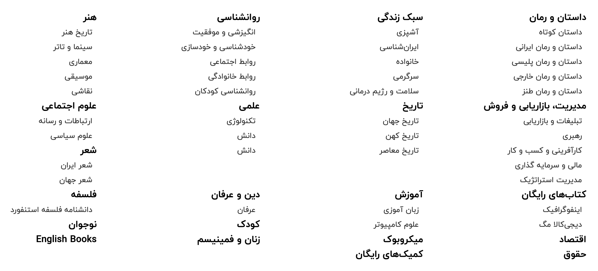
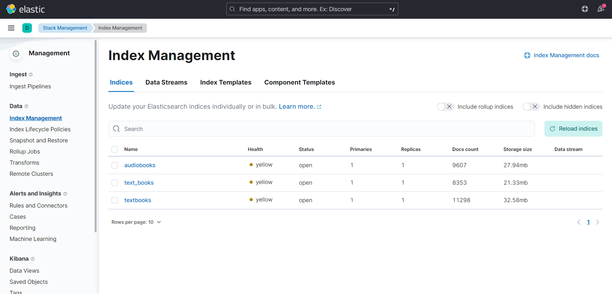

# Information Retrieval (IR) Homework

In this repository, the result of our teamwork (Hojjat Rezaei, 
Navid All Gharaee, Amirali Vojdanifard, and I) are gathered in the form of different folders which are as follows:

* Text preprocessing & indexing
* Data crawling
* Elastic search

## Text preprocessing & indexing:
In this phase, we were supposed to work with a dataset containing information of 2824 provided in <a href="https://github.com/mohamad-dehghani/persian-pdf-books-dataset">here</a>. In this regard, first, we preprocessed and tokenized the content of each book. As the next step, we performed invert-indexing on the extracted tokens. 
Please note that since the process of preprocessing different pieces of text was completely independently done, in order to speed up the process, we performed preprocessing step via multiple threads (user can specify the number of threads by `--threads`)

### Preprocessing:
In this step, we performed various text preprocessing techniques such that users can enable/disable each of them, based on their needs, by passing a `True` flag while running the program.
       

       main.py [-h] [--raw-data-path RAW_DATA_PATH]
               [--preprocessed-data-path PREPROCESSED_DATA_PATH]
               [--indexed-data-path INDEXED_DATA_PATH] [--threads THREADS]
               [--normalize NORMALIZE] [--remove-stop-words REMOVE_STOP_WORDS]
               [--remove-punctuations REMOVE_PUNCTUATIONS] [--lemmatize LEMMATIZE]
               [--stemmer STEMMER] [--verbose VERBOSE]

The used text preprocessing techniques are as follows:
* normalize
* remove punctuations
* remove stop words
* lemmatize
* stemmer

### Invert indexing:
By having preprocessed tokens in hand, the invert-indexing step was so straightforward. We only had to create a dictionary such that its keys were tokens and its values were the index(ID) of each document containing that token.

## Data crawling:
In this project, we were supposed to crawl data from the website *https://fidibo.com/* - a Persian website containing the information of a ton of text/audio books. There were various categories that our program had to crawl each one separately. The categories are as follows:

Although numerous information fields were shared between audiobooks and textbooks, each of them had its specific fields. The extracted fields for each type of book (audio/text) are as follows:

Text books

* Title
* Authors
* Translator
* Price
* Publisher
* Printed price
* Publication date
* Language
* Volume (in Megabyte)
* Number of pages
* ISBN
* Description
* Category
* Book's cover address

Audio books

* Title
* Authors
* Translator
* Broadcaster
* Price
* Publisher
* Printed price
* Publication date
* Language
* Volume (in Megabyte)
* Description
* Category
* Book's cover address

It is worth mentioning that, while it is highly plausible that all of the aforementioned fields are not defined for a book, our crawler has been robustly designed to handle those exceptional cases. Furthermore, the crawler identifies and ignores the duplicate links.

## Elastic Search:
First, we combine all data from the categories we previously crawled in the last phase into two dataframes - text_df and audio_df. After that, we need to preprocess data to use them for elasticsearch.
The preprocessing steps that we have done includes:
1. Converting all `None` to np.NaN
2. If ***translator***, ***description***, and ***ioc_cover*** are null in ***textbooks***, we replace them with **have not** and the for other features, we replace them with **unknown**.
3. If ***translator*** and ***description*** are null in ***audiobooks***, we replace them with **have not**. On the other side for other features, we replace it with **unknowns**.
4. Converting all numbers to English digits.

Finally, we transfer our data to Elasticsearch and view our data with the help of ***Kibana***.

